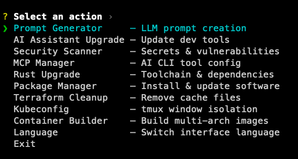

# DevOps ツールセット

DevOps ワークフローの効率化のために設計された、堅牢な Rust 製 CLI ツールセットです。

[English](../README.md) | [繁體中文](README_zh-TW.md) | [简体中文](README_zh-CN.md)



## 機能

### 1. Terraform/Terragrunt キャッシュクリーナー
Terraform および Terragrunt によって生成されたキャッシュファイルをインテリジェントに削除します：
- `.terragrunt-cache` ディレクトリ
- `.terraform` ディレクトリ
- `.terraform.lock.hcl` ファイル
- 重複するサブパスを自動的に除外し、冗長な削除を回避します。

### 2. AI コードアシスタントアップグレーダー
人気のある AI コードアシスタントツールを一括アップグレードします：
- `Claude Code` (@anthropic-ai/claude-code)
- `OpenAI Codex` (@openai/codex)
- `Google Gemini CLI` (@google/gemini-cli)

### 3. パッケージのインストール/更新（macOS/Linux）
対話式のチェックリストでインストール・削除・更新を行います：
- `nvm`（最新 Node.js をインストール）
- `pnpm`
- `Rust`（rustup 経由）
- `Go`（最新公式アーカイブ/pkg を取得）
- `Terraform`
- `kubectl`
- `kubectx`
- `k9s`
- `git`
- `uv`（最新 Python をインストール）
- `tmux`（TPM と tmux.conf をセットアップ）
- `vim`（vim-plug と molokai 設定）
- `ffmpeg`（Linux はビルドスクリプト、macOS は Homebrew）

### 4. MCP ツール管理
Claude、Codex、Gemini CLI 用の MCP サーバーを管理します：

| MCP ツール | 説明 |
|------------|------|
| `sequential-thinking` | シーケンシャル・シンキング |
| `context7` | ドキュメント検索 |
| `chrome-devtools` | Chrome 開発者ツール |
| `kubernetes` | K8s 管理 |
| `github` | GitHub 統合 |
| `cloudflare-*` | Cloudflare MCP（Docs/Workers/Observability など） |

**環境変数**（オプション - MCP管理機能を使用する場合のみ必要、ビルド時に `.env` で設定）：
- `GITHUB_PERSONAL_ACCESS_TOKEN`
- `GITHUB_HOST`
- `CONTEXT7_API_KEY`
- `enable_cloudflare_mcp`（`true` で Cloudflare MCP を有効化）

Codex の MCP インストールでは、`CONTEXT7_API_KEY`、`GITHUB_PERSONAL_ACCESS_TOKEN`、`GITHUB_HOST` のビルド時の値を `~/.codex/config.toml` に書き込むため、実行時の環境変数は不要です。
Cloudflare MCP は OAuth の対話ログインを使用するため、CLI に表示される URL で認可を完了してください。WSL の場合は `wslview <URL>` を使用できます。

### 5. プロジェクトセキュリティスキャナー
現在の Git リポジトリを厳格モードで素早くスキャンします：
- `gitleaks`（Git 履歴 + ワーキングツリー）
- `trufflehog`（Git 履歴 + ワーキングツリー）
- `git-secrets`（Git 履歴 + ワーキングツリー）
- `trivy`（ワーキングツリーの SCA + Misconfig）
- `semgrep`（ワーキングツリーの SAST）

自動インストールは一般的なパッケージマネージャー、Trivy のインストールスクリプト、Semgrep の pipx/venv を優先し、見つからない場合は GitHub Release から取得します（`curl`/`wget` と `tar`/`unzip` が必要です）。
ワーキングツリーのスキャンは Git で追跡済みかつ `.gitignore` で除外されていないファイルのみ対象で、各スキャンの生ログを出力します。

### 6. プロンプトジェネレーター（LLM）
LLM ワークフロー用の 4 ステッププロンプトを生成・実行します：
- **生成**：YAML/JSON 仕様ファイルからプロンプトファイルを作成
- **実行**：Claude CLI による対話式または自動プロンプト実行
- **ステータス**：機能の実行進捗とステータスを確認

[機能仕様書作成用プロンプトテンプレートを見る](PROMPT_TEMPLATE.md)

4 ステップワークフロー：
1. P1：要件、実装、デプロイ
2. P2：検証環境での E2E 検証
3. P3：リファクタリングと最適化
4. P4：検証環境での E2E 回帰テスト

各機能の進捗を追跡し、セッション管理により中断後の再開が可能です。

## インストール

### インストールスクリプト経由 (推奨 - Linux/macOS)

```bash
curl -fsSL https://raw.githubusercontent.com/DennySORA/Ops-Tools/main/install.sh | bash
```

### 手動インストール

[Releases](https://github.com/DennySORA/Ops-Tools/releases) ページから、お使いのシステムに対応するバージョンをダウンロードしてください。

### ソースコードからのビルド

```bash
# ビルド
cargo build --release

# 環境変数の設定 (オプション、MCP 管理機能を使用する場合)
cp .env.example .env
# .env を編集して認証情報を入力
```

## 使用方法

スクリプト経由でインストールした場合は、直接実行できます：

```bash
ops-tools
```

ソースコードからビルドした場合：

```bash
cargo run
# または
./target/release/tools
```

機能メニューを選択してください：
1. Terraform/Terragrunt キャッシュファイルのクリーニング
2. AI コードアシスタントツールのアップグレード
3. システムパッケージのインストール/更新（macOS/Linux）
4. Rust プロジェクトとツールチェーンのアップグレード
5. セキュリティスキャン (Gitleaks/TruffleHog/Git-Secrets/Trivy/Semgrep)
6. MCP ツールの管理 (Claude/Codex/Gemini)
7. プロンプトジェネレーター（LLM 4 ステップワークフロー）
8. 言語設定（英語/繁体字中国語/簡体字中国語/日本語）

起動時に言語選択が表示され、後からメニューで切り替えできます。
言語設定は `~/.config/ops-tools/config.toml`（Linux）、`~/Library/Application Support/ops-tools/config.toml`（macOS）、`%APPDATA%\\ops-tools\\config.toml`（Windows）に保存されます。

## 貢献

Pull Request や Issue の作成は大歓迎です！

## ライセンス

MIT License
