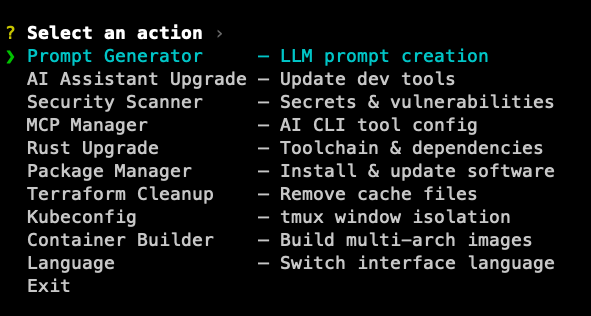

# Ops-Tools

基于 Rust 的高性能 CLI 工具集，专为 DevOps 工作流程设计。

[English](../README.md) | [繁體中文](README_zh-TW.md) | [日本語](README_ja.md)



## 功能总览

| 分类 | 功能 | 说明 |
|------|------|------|
| 升级 | 系统升级 | 跨平台系统维护（Linux APT / macOS Homebrew + 工具） |
| 升级 | AI 工具升级 | 批量更新 Claude Code、Codex、Gemini CLI |
| 升级 | Rust 升级 | 升级 Rust 工具链 + Cargo 工具 |
| 升级 | 软件包管理 | 安装/更新 nvm、pnpm、Rust、Go、kubectl、k9s、tmux 等 |
| 构建 | Rust 编译 | 跨平台 Rust 可执行文件（cargo/cross，30+ 目标） |
| 构建 | 容器构建 | Docker/Buildah 多架构构建（x86、arm64、armv7、Jetson） |
| 构建 | CUDA ML 构建 | 从源码构建 ML 套件（PyTorch、Flash Attention、xFormers） |
| AI | MCP 管理 | 管理 Claude/Codex/Gemini 的 MCP 服务器 |
| AI | 技能安装器 | 安装 AI CLI 扩展（Claude/Codex/Gemini） |
| 基础设施 | Terraform 清理 | 移除 `.terraform`、`.terragrunt-cache` 及 lock 文件 |
| 基础设施 | Kubeconfig 管理 | tmux 窗口隔离的 kubeconfig |
| 安全 | 安全扫描 | 运行 gitleaks、trufflehog、git-secrets、trivy、semgrep |

## 菜单结构

交互式菜单将功能分为 5 个分类，按使用频率智能排序：

```
常用（按使用频率排序）
  系统升级、AI 工具升级、...

分类
  构建      — Rust 编译、容器构建、CUDA ML 构建
  AI        — MCP 管理、技能安装器
  升级      — 系统升级、AI 工具升级、Rust 升级、软件包管理
  基础设施  — Terraform 清理、Kubeconfig 管理
  安全      — 安全扫描

设置      — 语言、常用数量、置顶管理
```

置顶的项目显示在最上方。常用项目按使用频率自动排序。

## 功能特色

### 系统升级
具备平台感知能力的跨平台系统维护：
- **模式**：完整更新、仅扫描、清理、验证、备份
- **配置文件**：默认（完整）、安全（不重启、保守清理）、激进（深度清理）
- **Linux 流程**：APT 升级、NVIDIA/WSL 主机的 CUDA Toolkit runfile 升级、DGX 内核/驱动、Snap/Flatpak/Docker、工具更新（nvm、bun、deno、pipx、conda、pnpm、Rust、uv）、缓存清理、验证、重启决策
- **macOS 流程**：Homebrew 更新/升级、保守的 `softwareupdate`、工具更新、缓存清理、验证与维护快照
- **CUDA 自动检测**：从 NVIDIA runfile 索引、`nvidia-smi`、`nvcc`、`dpkg` 自动检测最新版 runfile、GPU 架构、WSL CUDA 信号与驱动/内核包
- **平台检测**：运行时自动识别 Linux 与 macOS，并安全跳过不支持的步骤
- **配置**：`update.toml` 或 `~/.config/update/config.toml`（参见 `update.example.toml`）
- 支持试运行模式预览变更

### AI 工具升级
批量升级 AI 代码助手工具：
- `Claude Code` (@anthropic-ai/claude-code)
- `OpenAI Codex` (@openai/codex) — 支持从本地 repo 源码构建
- `Google Gemini CLI` (@google/gemini-cli)

### 软件包管理（macOS / Linux）
通过交互勾选安装、移除与更新常用工具：
- `nvm`（安装最新 Node.js）、`pnpm`、`Rust`（通过 rustup）、`Go`（最新官方压缩包）
- `Terraform`、`kubectl`、`kubectx`、`k9s`、`git`、`uv`（安装最新 Python）
- `tmux`（包含 TPM + tmux.conf 设置）、`vim`（包含 vim-plug + molokai 设置）
- `ffmpeg`（Linux 使用构建脚本，macOS 使用 Homebrew）

### Rust 升级
升级 Rust 工具链与 Cargo 工具：
- 检查 rustc、cargo、rustup 版本
- 安装缺少的 Cargo 工具（cargo-edit、cargo-update、cargo-outdated、cargo-audit）
- 6 步骤升级：rustup self-update、rustup update、cargo install-update、cargo upgrade、cargo outdated、cargo audit

### CUDA ML 构建
从源码为你的 GPU 构建 CUDA 加速 ML 套件：
- **套件**：PyTorch、TorchVision、TorchAudio、Flash Attention、xFormers、FlashInfer、BitsAndBytes、ExLlamaV2、AutoGPTQ、AutoAWQ、llama-cpp-python、CTranslate2、TensorRT、Transformer Engine、DeepSpeed、vLLM、CuPy、Unsloth
- **模式**：从源码构建、从缓存安装、状态、清理
- 自动检测 CUDA 版本、GPU 架构及构建优化（ccache、Ninja、clang、mold）
- 隔离构建环境于 `~/.ml-packages/`

### MCP 管理
管理 Claude、Codex 和 Gemini CLI 的 MCP 服务器：

| MCP 工具 | 说明 |
|----------|------|
| `sequential-thinking` | 循序思考 |
| `context7` | 文档查询 |
| `chrome-devtools` | 浏览器开发工具 |
| `kubernetes` | K8s 管理 |
| `tailwindcss` | Tailwind CSS |
| `arxiv-mcp-server` | arXiv 论文搜索与下载 |
| `github` | GitHub 整合 |
| `cloudflare-*` | Cloudflare MCP 服务器 |

**可选 MCP 凭证**（编译时通过 `.env` 设置）：
1. `cp .env.example .env`
2. 填入所需的值
3. 使用 `cargo build --release` 编译

可用选项：
- **Context7**：设置 `CONTEXT7_API_KEY`
- **GitHub**：设置 `GITHUB_PERSONAL_ACCESS_TOKEN`（必需），可选 `GITHUB_MCP_MODE`、`GITHUB_HOST`、`GITHUB_TOOLSETS`
- **Cloudflare**：设置 `enable_cloudflare_mcp=true`（安装时 OAuth）
- **arXiv**：设置 `ARXIV_STORAGE_PATH`（默认 `~/.arxiv-papers`）

### 技能安装器
安装 AI CLI 工具的扩展：

| CLI | 扩展格式 | 安装路径 |
|-----|---------|---------|
| Claude Code | Plugins + Skills | `~/.claude/plugins/`、`~/.claude/skills/` |
| OpenAI Codex | Skills (SKILL.md) | `~/.codex/skills/` |
| Google Gemini | Extensions (TOML) | `~/.gemini/extensions/` |

可用扩展：ralph-wiggum、security-guidance、frontend-design、code-review、pr-review-toolkit、commit-commands、writing-rules、claude-mem、loop-runner 等。

详见 [docs/SKILL_INSTALLER.md](SKILL_INSTALLER.md) 开发指南。

### Rust 编译器
跨平台构建 Rust 可执行文件：
- **引擎**：cargo（原生）或 cross（容器化交叉编译）
- **30+ 目标**：x86_64-gnu、x86_64-musl、aarch64、i686、powerpc64le、wasm32 等
- 自动安装缺少的 rustup 目标

### 容器构建器
构建多架构容器镜像：
- **引擎**：Docker (buildx) 或 Buildah（无守护进程）
- **架构**：x86_64、arm64、armv7、Jetson Nano
- 自动检测 Dockerfile/Containerfile 变体
- Registry 推送，记住常用设置

### Terraform 清理
智能清理 Terraform/Terragrunt 缓存：
- `.terragrunt-cache`、`.terraform`、`.terraform.lock.hcl`
- 自动去重避免重复删除

### Kubeconfig 管理
tmux 窗口隔离的 kubeconfig，安全进行多集群操作：
- 设置、清除、列表、清除全部
- 防止意外切换到其他集群

### 安全扫描
安装并以严格模式扫描 Git 项目：
- `gitleaks`、`trufflehog`、`git-secrets`（历史 + 工作树）
- `trivy`（SCA + misconfig）、`semgrep`（SAST）
- 内建供应链启发式扫描，递归检测子文件夹内的 npm、Python、Rust 套件文件
- 标记 npm install scripts、远端/本机依赖、缺少 lockfile、Python lockfile URL/index 来源、Rust 替代 registry、git/path 依赖、缺少 integrity/checksum 资料
- 自动安装，扫描 Git 追踪与未被忽略的未追踪文件，并遵守 `.gitignore`

## 安装

### 安装脚本（Linux / macOS）

```bash
curl -fsSL https://raw.githubusercontent.com/DennySORA/Ops-Tools/main/install.sh | bash
```

### 手动下载

从 [Releases](https://github.com/DennySORA/Ops-Tools/releases) 页面下载预构建的版本：
- Linux x86_64
- macOS x86_64 / arm64 (Apple Silicon)
- Windows x86_64

### 从源码编译

```bash
cargo build --release
./target/release/tools

# 可选：设置 MCP 凭证
cp .env.example .env
# 编辑 .env，然后重新编译
```

## 多语言支持

支持 4 种语言 — 首次启动时选择，可从设置中切换：

- English
- 繁體中文
- 简体中文
- 日本語

语言偏好保存位置：
- Linux：`~/.config/ops-tools/config.toml`
- macOS：`~/Library/Application Support/ops-tools/config.toml`
- Windows：`%APPDATA%\ops-tools\config.toml`

## 贡献

欢迎提交 Pull Request 或建立 Issue！

详见 [CONTRIBUTING.md](../CONTRIBUTING.md) 开发指南。

## 授权

MIT License
